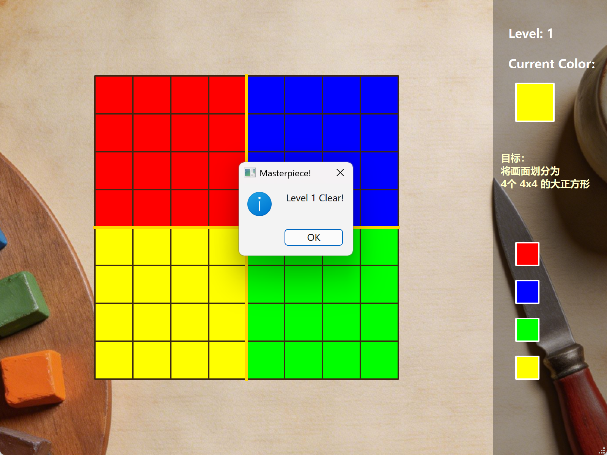

The Artisan of Glimmith (格里米斯的大工匠)
一个基于 Qt Framework (C++) 开发的关卡制几何逻辑分割游戏。玩家通过色彩划分区域，解决各种具有挑战性的几何约束问题。

🎨 项目简介
在《格里米斯的大工匠》中，你将扮演一名色彩工匠。每一个关卡都是一块破碎的彩色玻璃，你需要根据古老的“提示（Hint）”，利用画笔和油漆桶工具，将网格划分为符合特定数学或几何规则的区域。

🚀 功能特性
多维度关卡设计：

Level 1: 基础空间划分（4x4 正方形判定）。

Level 2: 不规则形状挑战（Domino 与 L-shape 判定）。

Level 3: 面积挑战（五与六，奇偶数网格划分）。

Level 4:三倍约束挑战（三位一体，3的倍数面积判定）。

沉浸式体验：

复古的纸张纹理背景。

实时连通区域边框渲染（高亮显示不同区域的边界）。

完整的音效反馈（绘画声、通关奶龙爆笑声）。

技术细节：

采用 Strategy Pattern (策略模式) 管理关卡逻辑，易于横向扩展新关卡。

自定义 Mouse Event Handling，实现精准的调色板点击判定。

基于 QPainterPath 的自定义图形渲染。

🛠️ 技术栈
Language: C++17

Framework: Qt 6.11.0
Build Tool: qmake / CMake

Assets: 自定义 QRC 资源管理

📸 游戏预览

⌨️ 核心算法说明
项目中的难点之一是连通区域判定与动态边界绘制。我们通过 partId 来追踪每一个 GlassPiece 所属的区域，并在 paintEvent 中通过相邻格子的 partId 差异来实时绘制高亮边框：

C++
if (p1.partId != p2.partId) {
    // 绘制区域分割线
    painter.drawLine(topRight, bottomRight); 
}
📦 如何运行
确保已安装 Qt 运行环境。

克隆仓库：

Bash
git clone https://github.com/lhhshh-lhh/The_Artisan_of_Glimmith_.git
使用 Qt Creator 打开 .pro 文件。

构建并运行（建议在构建前先运行一次 qmake）。

📝 开发日志
2026-05: 修复了调色板点击坐标偏移 Bug，增加了第 3、4 关卡逻辑，实现了基于策略模式的关卡加载机制。